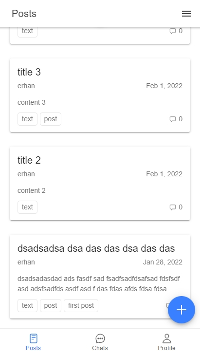
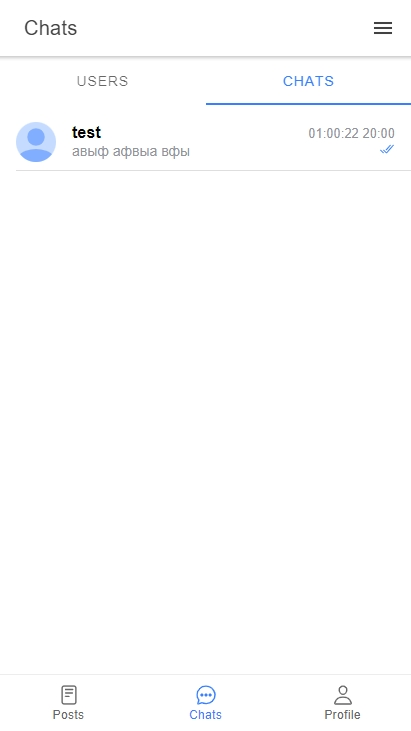

# Real time forum

* Frontend application for [backend](https://github.com/innovember/real-time-forum/tree/develop)

## Backend starting

- Go to the link given above, clone the repo and run the backend server.

## Frontend starting

- Forum requires [Node.js](https://nodejs.org/) to run.
- Make sure that you have the latest LTS version of node.
- Open a terminal instance in the root folder:

```sh
npm i
npm start
```

## Screenshots

- Main page, user is not logged in
- 
- Main page, user is logged in
- 
- Post page and comments
- 
- Create post form
- 
- Select categories form
- 
- Chats
- 
- Real time chat
- 
